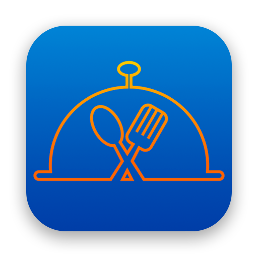

   
  <a href="https://youtu.be/VYO2fdsAfr4">Watch Demo on YouTube</a>
  <h1>Takitasty</h1>
  <b>An iOS app for discovering popular and local restaurants. Powered by Zomato API</b>
   
  <h2>Screenshots</h2>
  
   
  
  

### Technologies Used
* Swift
* UIKit
* [Lottie for iOS](https://github.com/airbnb/lottie-ios)

This app is powered by data provided by [Zomato API](https://developers.zomato.com/).

### Usage
Make an `APIKey.swift` file and put your Zomato API key in a `value` there.
